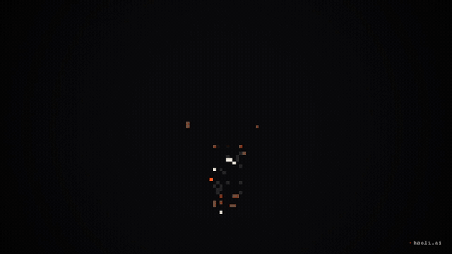
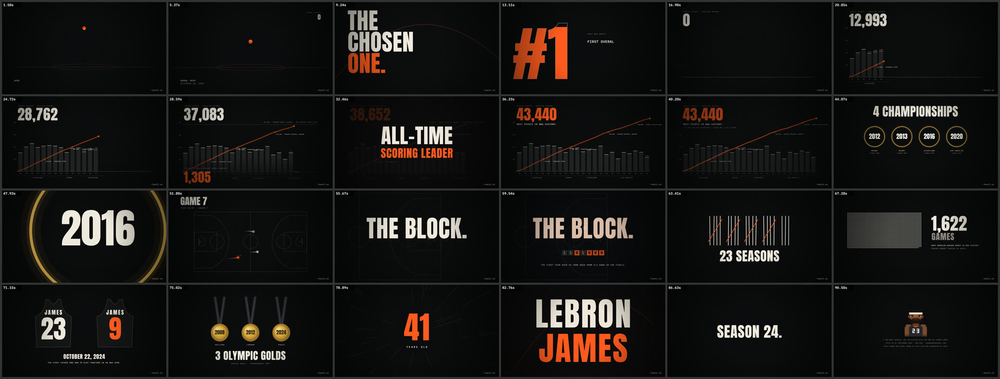

# claude-prompt-films

**One prompt → a finished film.** Every frame is drawn in code and every note is synthesized.
There are no video models, no stock footage and no samples.



> *Make a promo film about LeBron James. 90 seconds. Rich in content, not abstract: real numbers, dates
> and moments. Show why it is great. The visuals should hit hard.*

That prompt, given to [Claude Code](https://claude.com/claude-code) running Claude Opus 5.5, produced
[`films/lebron`](films/lebron): 90 seconds at 1080p60. Claude researched and sourced every stat,
designed the film, wrote the canvas animation and a soundtrack built from his numbers, and reviewed its
own contact sheets until the frames were clean.



## Episodes

The series is **90 SECONDS**: every film runs exactly 90 s, with a countdown to 00:00 in the corner.
Every episode renders in two formats from the same code: 16:9 for YouTube, Bilibili and X, and 9:16 for
Shorts, TikTok and Reels: a hook on top, then the film, zoomed chapter by chapter inside the area that all three apps
leave uncovered by their buttons and captions.

| EP | Film | Length | The idea |
|---|---|---|---|
| 01 | [LeBron James: 43,440](films/lebron) | 90 s | The scoring line chases Kareem and breaks the record on the downbeat. The melody is his 23 seasons; a pixel chalk toss explodes into the drop. |
| 02 | [Cristiano Ronaldo: 979](films/ronaldo) | 90 s | A wall of 1,000 squares, one per goal, coloured by club, with 21 still empty. City sounds from fado to oud, and a synthesized stadium chanting SIUUU. Built to re-render the day No. 1,000 goes in. |
| 03 | [Lionel Messi: Too Small](films/messi) | 90 s | Too small at 10, signed on a napkin at 13. His 931 goals grow like tree rings, one per season, inside a bark of 125 for Argentina, and 46 trophies stack up beside a 1.70 m man. An electrotango with a bandoneón, and a crowd chanting ME-SSI. Ends on his last game for Argentina, 6 October 2026. |
| 04 | [Messi vs Ronaldo: GOAT FIGHT ’26](films/messi-vs-ronaldo) | 90 s | The first pixel episode ([`PIXEL_STYLE.md`](PIXEL_STYLE.md)): a 16-bit fighting game drawn natively in 9:16. Select screen, VS, then six rounds with one stat each (goals, Ballon d’Or, Champions League, World Cup, goals for country, trophies). Each wins three; SIUUU, the bicycle kick and La Pulga's dash are special moves. The final round ends in a DOUBLE K.O., and the end card asks who your GOAT is. Chiptune in A minor. |
| 05 | [Shohei Ohtani: SHO-TIME BASEBALL ’26](films/ohtani) | 90 s | A 16-bit baseball game in which he plays both ends: Ohtani pitches to Ohtani. Six innings are six seasons, from 2018's Rookie of the Year to the 2023 WBC (full count, Mike Trout, the last out) and the first 50/50, while the career home-run counter climbs to 310. Chiptune with a ballpark organ; the WBC inning turns to the Japanese yo scale. |

## What's in the LeBron film

| Time | Chapter |
|---|---|
| 0–2 s | Cold open: the chalk toss explodes into 43,440, then the tape rewinds to the start |
| 2–8 s | Akron, 1984: a ball dribbling faster and faster, then launching into the lens |
| 8–16 s | THE CHOSEN ONE → #1 pick, 2003 → an "AGE 18" stamp |
| 16–42 s | 23 seasons rise one per beat; the scoring line creeps up to Kareem's 38,387, ties it, and breaks it on the downbeat |
| 42–60 s | The line curls into four rings → 2016, down 3–1 → Game 7 on a top-down court → THE BLOCK |
| 60–76 s | 23 tally marks, 1,622 squares, father and son jerseys, three Olympic golds |
| 76–90 s | Every number at once → a pixel chalk toss explodes into 43,440 → LEBRON JAMES → SEASON 24. PHILADELPHIA. |

### The soundtrack is his too

- **Career melody**: each season's points become a note, played the moment its column grows.
  Better seasons sing higher. The record season repeats one note until the record falls.
- **Cities**: the instruments follow his teams. Cleveland is industrial (FM bells, anvil), Miami is bright
  (saw lead, shaker, congas), Los Angeles is a G-funk whistle, and Philadelphia gets a bar of Philly soul.
- **"23" motif**: scale degrees 2 and 3 (his number), then 6 (his other number), then home. It returns in every chapter:
  solo keys, synth lead, gold bells, full brass, and 8-bit over the closing pixel portrait.

## How it works

```
Chrome (headless)                          Bun (render/render.ts)
 film.draw(ctx, t) ─► getImageData ─WS─►  ffmpeg stdin (rawvideo RGBA) ─► out/<slug>.mp4
 film.score(ac)    ─► Float32 PCM  ─WS─►  score.wav ───────────────────┘
```

- A frame is a **pure function of time**, so the browser preview and the export are identical, and any
  frame can be rendered on its own.
- Frames stream straight into ffmpeg and never touch the disk.
- **Exact**: numbers and type are real text, and hits land on the beat to the millisecond.
- **Editable**: changing a stat or a colour is a one-line diff, not a re-roll.

Stack: Canvas 2D + Web Audio (`OfflineAudioContext`), [Bun](https://bun.sh), `playwright-core` driving the
installed Google Chrome, ffmpeg (libx264, BT.709). Fonts: Anton and IBM Plex Mono (SIL OFL) via `@fontsource`.

## Quick start

Needs Bun, Google Chrome and ffmpeg.

```bash
bun install
bun render/render.ts serve                          # preview → http://localhost:5173/films/lebron/
bun render/render.ts video films/lebron             # → out/lebron/full-16x9.mp4 + full-9x16.mp4 (~7 min each on an M1 Pro)
bun render/render.ts video films/lebron --format 9x16   # just one format
bun render/render.ts sheet films/lebron --count 36  # contact sheet → out/lebron/work/sheet.png
bun render/render.ts stills films/lebron --at 12,32,55 [--format 9x16]
bun render/render.ts video films/lebron --from 30 --to 40 --fps 30 --out out/draft.mp4
bun render/render.ts cuts films/messi               # the film's short clips → out/messi/clip-<cut>-9x16.mp4
bun render/render.ts reframe films/messi            # 9:16 framing per chapter → films/messi/reframe.json
bun test                                            # unit tests (the cold open's timing and audio splice)
```

`out/<film>/` holds only what gets posted (`full-*`, `clip-*`); scratch files (stills, sheets) go to `out/<film>/work/`.

**Clips.** A film can export `cuts`: 14–23 s ranges, each with its own phone headline. `cuts` renders them for
Shorts, TikTok and Reels with no countdown and a "FULL 90 SECONDS / ON MY PROFILE" card in the header over the last 2.4 s (in place of the
hook, so the clip's ending stays uncovered), so every
clip sends viewers to the full film. Each clip also opens on its own cold open (below). Post the full film first,
then the clips over the next few days.

**Cold open and end card.** Feeds decide in a second or two, so a film can export `coldOpen: { from, length }`: its first
bar plays the payoff (the 43,440 explosion, the SIUUU, WORLD CHAMPION) and then scrubs backwards into the start like a
rewinding tape, with the sound spliced to match (`render/coldopen.js`). The film stays exactly 90 s. The 9:16 version
ends on a "WHO’S NEXT? / COMMENT A PLAYER" card in the header. A clip's own `coldOpen` does the same with the clip's best moment
(ÁGUA, THE BLOCK, the napkin), played in the bar before the clip, so the clip itself stays whole.

Add `--no-watermark` to any render. Preview keys: `space` play/pause · `←/→` ±1 s (shift ±5 s) ·
`,`/`.` one frame · `h` hide the HUD.

## Make your own

Open this folder in Claude Code and say:

```
Follow PROMO_PROMPT.md to make a film about <anything>.
```

[`PROMO_PROMPT.md`](PROMO_PROMPT.md) is the whole recipe: research with sources, insider references, the concept,
the music, the self-review loop, and a posting kit. For a one-word command, save this as `.claude/commands/promo.md`
and run `/promo <keyword>`:

```markdown
---
description: Make a code-rendered film from one keyword, plus a ready-to-post caption
argument-hint: <keyword> [seconds]
---
Make a promo film about: $ARGUMENTS

Follow PROMO_PROMPT.md in this repo from research to post.md, without stopping to ask unless
something is genuinely ambiguous. Use films/lebron as the reference implementation.
When done, report the MP4 path, its length and size, and the insider references you used.
```

## Layout

```
render/
  kit.js        easing, typography, grain, camera shake, pixel sprites + figure rig, synth instruments
  player.js     one page, three modes: preview · still · render (streams frames over WebSocket)
  vertical.js   the 9:16 frame around any 16:9 film (hook · film reframed per chapter · chapter · end card)
  coldopen.js   the cold open: payoff first, then a rewind into the film or clip (+ coldopen.test.js)
  player.css    fonts + preview layout
  brand.js      the watermark (haoli.ai), the series name and the countdown
  render.ts     CLI: serve / stills / sheet / video
films/<slug>/
  facts.md      every on-screen number with its source, plus insider references
  reframe.json  9:16 framing per chapter (written by `render.ts reframe`)
  film.js       the film: draw(ctx, t) + score(ac)
  sprites.js    pixel-art sprites, drawn from scratch
  post.md       titles, descriptions and hashtags for each platform
  index.html    loads player + film
PROMO_PROMPT.md the recipe
POSTING.md      how to post, platform by platform
plan/           strategy, calendar, backlog and posting log (in Chinese)
CLAUDE.md       rules every Claude Code session in this repo follows
```

## Notes

Films about real people are fan-made tributes. They use no footage, photos, broadcast audio or existing
songs, every stat is sourced, and each ends with a card saying it is not affiliated with its subject.
The LeBron film is not affiliated with the NBA or LeBron James.

Made by [haoli.ai](https://haoli.ai) with Claude Code. Code under the [MIT License](LICENSE).
